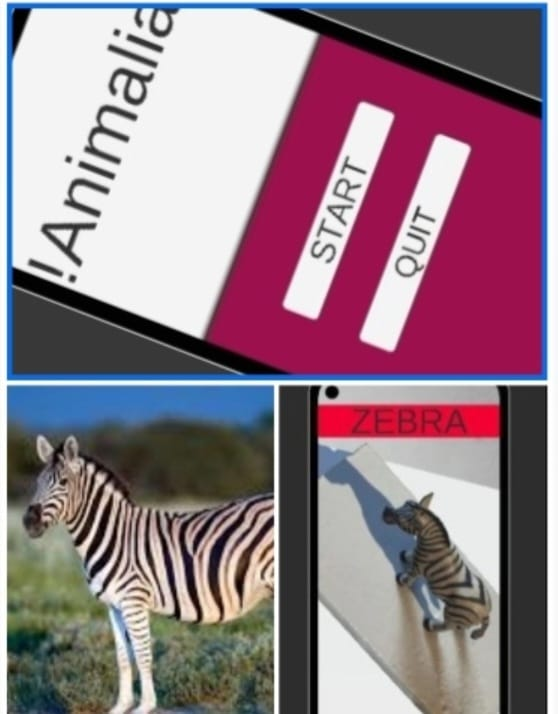
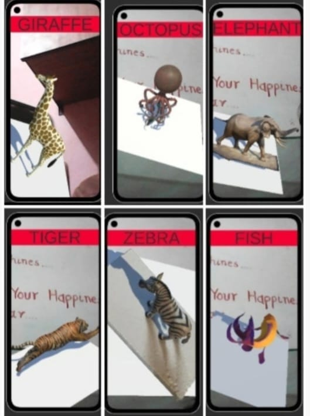

# AR_dictionary
An AR/VR Animal Dictionary app that uses image markers to detect animals and display their 3D models. Built with Unity and Vuforia, it offers an interactive way to learn about animals, ideal for education. Features include marker-based tracking, realistic models, and optional sounds or facts.

